# DDBOT的雨后小故事
## [DDBOT酱de小故事咩](https://ddbot.songlist.icu/docs/QQNT_DDBOT/DDBOT%E7%9A%84%E5%89%8D%E4%B8%96%E4%BB%8A%E7%94%9F%E5%96%B5/)
 ## 下载DDBOT

[点击我下载DDBOT](https://github.com/cnxysoft/DDBOT-WSa/releases)

  下载页面中共有超过20个版本的DDBOT，这是因为DDBOT支持Windows、Linux、MacOS等多个平台以及不同架构。

  你只需要下载一个适合你的版本即可。

  如果你不知道哪个版本适合你，推荐选择DDBOT-vX.X.X-windows-amd64.zip。

 ## 运行DDBOT
 ### 1.Windows运行方法

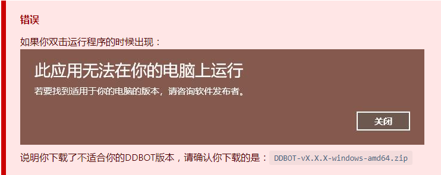
### 2.Linux运行方法
```
./DDBOT(替换为实际名称)
```
- 保持持久化运行
这里使用screen进行进程持久化操作（如果系统内没有screen的软件包可以通过如下指令安装） 
1. Ubantu
```
sudo apt install screen
```
2. CentOS
```
sudo yum install screen
```

- 保持持久化运行指令
```
screen -S ddbot
cd  DDBOT文件目录
./DDBOT(替换为实际名称)
```
- 查看持久化运行
```
screen -r ddbot 
```
- 退出持久化运行
```
screen -S ddbot -X quit
```


 #### (先看 **连接DDBOT** 并配置) 观察黑色命令框，如果你看到命令框内有显示：

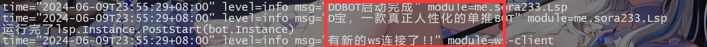

恭喜你，你已经成功启动了一个DDBOT。

现在，请保持DDBOT运行，然后使用电脑或手机登陆 管理员帐号，并对 BOT帐号 私聊发送：

```
/whosyourdaddy
```
BOT将会回复你：

```
成功 - 您已成为bot管理员
```
  
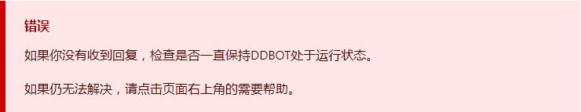

如果一切正常，你已经获得了BOT的最高权限。

当你顺利地操作到了这里，那你已经学会了和BOT交互的方式：发送QQ消息。

接下来让我们开始使用BOT，请邀请BOT创建一个群聊。（这个群聊是为了让你测试BOT有在正常工作，当你测试完成后，可以解散群聊。）

让我们来测试一下BOT的推送功能。

首先打开B站，登陆你的帐号，打开你的个人主页，找到你的UID。

我的UID为 97505，在下面的例子中我将用我的UID来演示。

当你实际进行测试的时候，请把我的UID替换成你的UID。

完成后打开群聊，在群聊内发送：

```
# 注意把我的UID替换成你实际的UID
/watch --type news 97505
```

如果BOT回复你：
```
watch成功 - bilibili用户 你的B站名字
```

这个命令会订阅用户的动态信息，当你输入的是你的UID时，你就订阅好了你B站帐号的动态推送。

接下来你可以去B站发送一条动态，并等待1分钟。

如果BOT把刚刚发送的B站动态转发到了QQ群聊里，说明BOT正在正常工作。（你可以删掉刚刚的动态）


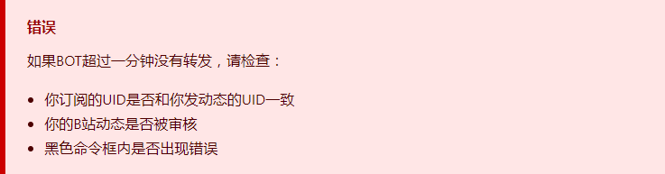

如果一切正常，请你对BOT私聊发送：

```
/help
```

BOT会告诉你一些最常用的功能，你可以继续在群里进行测试。

当你完成之后，你就已经会使用DDBOT的订阅推送功能了。


 ## 常见问题
    这里为你准备了一些常见问题，如果你是DDBOT新手，推荐你进行阅读。

    记住，如果你遇到问题，随时可以点击页面右上角的需要帮助。

 - #### DDBOT需要一直运行吗？
     是的，你无法在DDBOT没有运行的情况下使用它。

     常用方法是使用云服务器运行DDBOT。

     这是最推荐的做法，不必觉得云服务器离我们很远，它就是一台被设计来24小时运行的电脑，并且早已是现代互联网的一部分。

     如果你还没有用过它，那可能是因为过去你没有遇到需要用到它的地方，而现在，使用云服务器去运行DDBOT，可以成为一个好的理由。

     推荐的云服务器提供商：[腾讯云](https://cloud.tencent.com/)，[阿里云](https://cn.aliyun.com/)。

 - ##### 发送群消息失败，可能是被禁言或者账号被风控

 - ##### 如何获取B站Cookie（新版本可扫码登录）

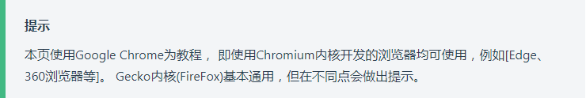

1、打开浏览器。

2、进入[bilibili](https://www.bilibili.com/)。

3、请确保你已登录bilibili账号！

4、在B站主页按下 F12 键打开开发者工具箱(DevTools)。

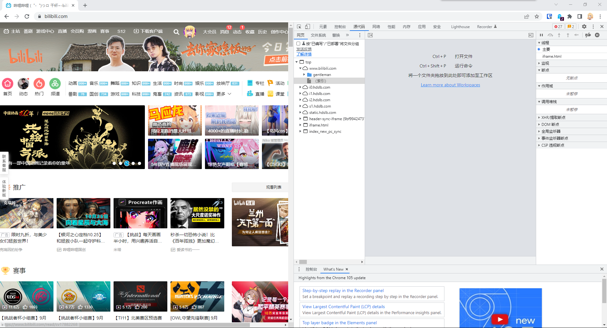


5、点击 应用(Application)->Cookie->https://www.bilibili.com (二级域名为bilibili都即可)。


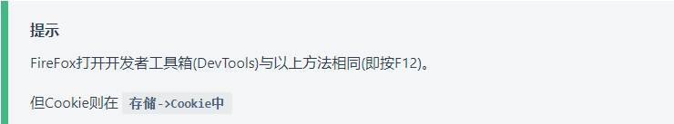

6、在选择二级域名为bilibili的Cookie中找到 名称(name)bili_jct和SESSDATA，并将值(key) 复制记录下来。

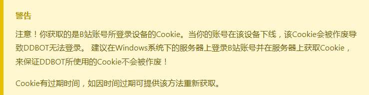

7、打开DDBOT的 application.yaml 文件，将获取的Cookie粘贴到对应的参数中！

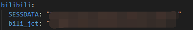

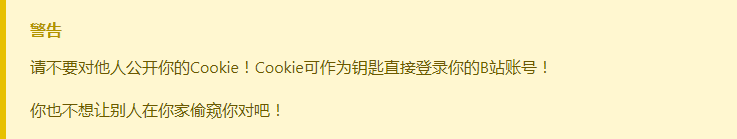

8、DDBOTWsa-a036之后版本可删除application.yaml 文件，即可触发扫码登录无需抓Cookie！

9、确定无误后启动DDBOT即可。

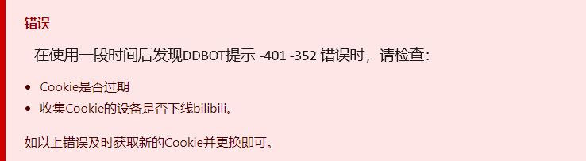

