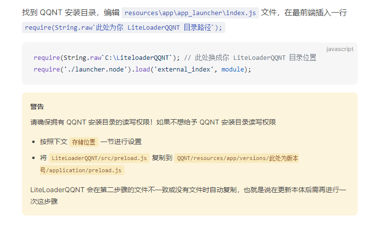
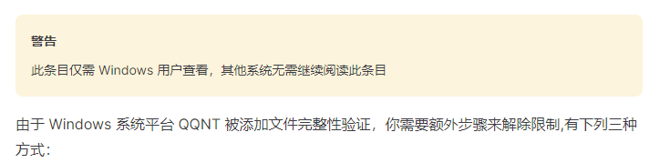
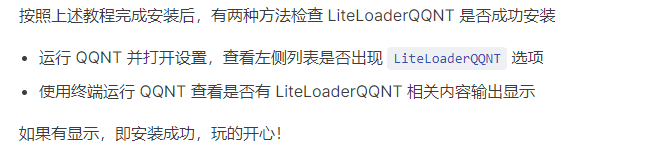
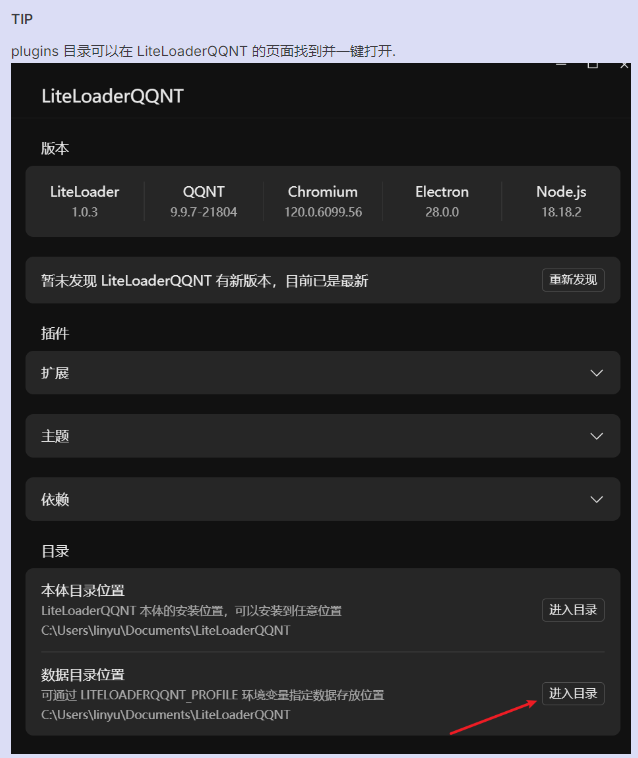

[https://llonebot.github.io/zh-CN/guide/getting-started](https://llonebot.github.io/zh-CN/guide/getting-started)

# 准备工作

[点击我下载QQNT](https://dldir1.qq.com/qqfile/qq/QQNT/Windows/QQ_9.9.10_240523_x64_01.exe)
## ①准备一台电脑，并装好NTQQ，然后登录QQ


## ②下载LiteLoaderQQNT
- LLOnebot5.0以上版本因LL架构更新无需安装LiteLoaderQQNT辣可直接下载LLOnebot运行exe即可食用
  
[LLOnebot5.0 全新版本食用地址喵](https://llonebot.github.io/zh-CN/guide/getting-started)

[点击我下载LiteLoaderQQNT](https://github.com/LiteLoaderQQNT/LiteLoaderQQNT/releases)


## ③安装LiteloaderQQNT

  - #### 注意在安装之前请先关闭 QQ ！
      安装成功后打开QQ的设置，看到了 LiteLoaderQQNT 就代表安装成功了.

```
require(String.raw`C:\LiteloaderQQNT`); // 此处换成你 LiteLoaderQQNT 目录位置
require('./launcher.node').load('external_index', module);
```



## ④修补LiteloaderQQNT



 - #### QQNTFileVerifyPatch

     在 Release 下载 exe 文件，运行将弹出文件选择框，进入 QQNT 安装目录选择 QQ.exe 开始修补，每次更新都需要重新修补
   
     [https://github.com/LiteLoaderQQNT/QQNTFileVerifyPatch/releases/tag/Patcher_v1.0.2](https://github.com/LiteLoaderQQNT/QQNTFileVerifyPatch/releases/tag/Patcher_v1.0.2)

## ⑤检查LiteloaderQQNT



## ⑥下载LLonebot
[点击我下载LLonebot](https://github.com/LLOneBot/LLOneBot/releases)


## ⑦安装LLonebot
  - #### 下载 LLOneBot 最新版本 解压放到 plugins 目录下，然后重启 QQ 即可.



ok火速下一步


## 连接DDBOT

#### 安装完成需开起反向连接并填入DDBOTws地址

```
ws://127.0.0.1:15630/ws
```
