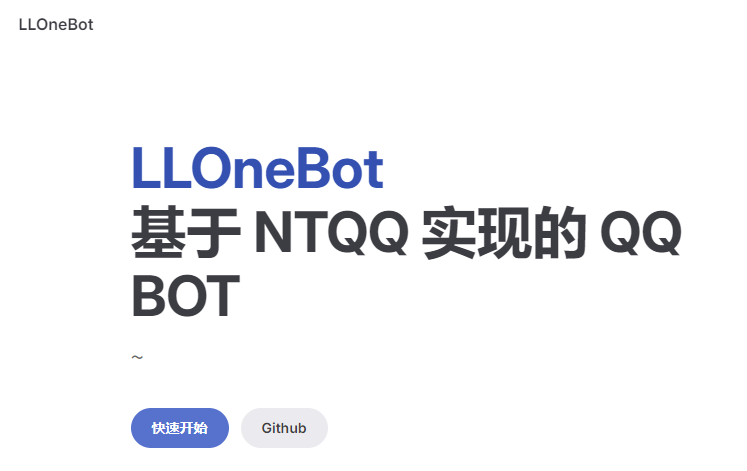

[https://llonebot.github.io/zh-CN/guide/getting-started](https://llonebot.github.io/zh-CN/guide/getting-started)

# 准备工作

[点击我下载QQNT](https://dldir1.qq.com/qqfile/qq/QQNT/Windows/QQ_9.9.10_240523_x64_01.exe)
## ①准备一台电脑，并装好NTQQ，然后登录QQ


  

## ②下载LLonebot
[点击我下载LLonebot](https://github.com/LLOneBot/LLOneBot/releases)



## ③安装LLonebot
  - #### 下载 LLOneBot 最新版本
  - [LLOnebot5.0 全新版本食用地址喵](https://llonebot.com/zh-CN/guide/getting-started)

ok火速下一步


## 连接DDBOT
#### 安装完成需开起反向连接并填入DDBOTws地址
LLOneBot 配置文件在data目录里

配置文件是自动生成的

修改后会自动重载，无需重启 QQ 和 LLOneBot

```json5
{
  "satori": {
    "enable": true,  // 是否启用 Satori 协议
    "port": 5600,  // Satori 监听端口
    "token": "" // Satori token
  },
  "ob11": {
    "enable": true, // 是否启用 OneBot 11 协议
    "token": "", // OneBot 11 协议的 token
    "httpPort": 3000, // HTTP 监听端口
    "httpPostUrls": [],  // HTTP 上报地址，如 ["http://localhost:8080/onebot/v11"]
    "httpSecret": "",  // HTTP 上报密钥
    "wsPort": 3001, // 正向 WebSocket 监听端口
    "wsReverseUrls": ["ws://127.0.0.1:15630/ws"], // DDBOT反向 WebSocket 地址
    "enableHttp": true, // 是否启用 HTTP 服务
    "enableHttpPost": true, // 是否启用 HTTP 上报
    "enableWs": true, // 是否启用正向 WebSocket 服务
    "enableWsReverse": true, // 是否启用反向 WebSocket 服务 这个一定要启动咩
    "messagePostFormat": "array", // 消息上报格式，支持 "array" 或 "string"
    "enableHttpHeart": false, // 是否启用 HTTP 心跳
    "reportSelfMessage": true // 是否上报自己的消息
  },
  "heartInterval": 60000, // 心跳间隔，单位毫秒
  "enableLocalFile2Url": false, // 是否启用本地文件转 URL 功能
  "debug": false, // 是否启用调试模式
  "log": true, // 是否启用日志
  "autoDeleteFile": false, // 是否自动删除收到的文件
  "autoDeleteFileSecond": 60, // 自动删除收到的文件的时间，单位秒
  "musicSignUrl": "", // 音乐签名地址
  "msgCacheExpire": 120, // 消息缓存过期时间，单位秒
  "onlyLocalhost": true, // 是否只监听本地地址，否则监听公网地址，暴露在公网请务必设置 token
}
```


